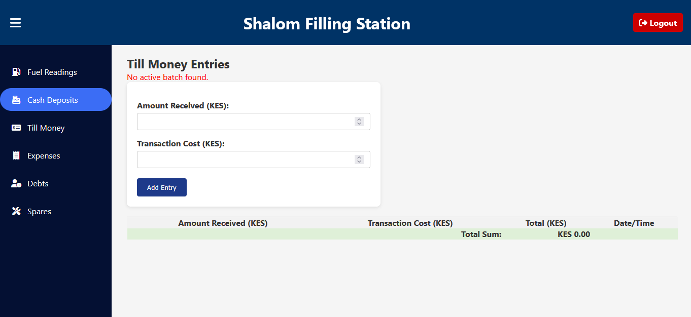

# ⛽ Shalom Filling Station Management System

A web-based management system tailored for daily operations of a petrol station. It includes separate dashboards for employees and administrators to handle fuel stock, sales, deposits, till money, debts, spares, expenses, and batch history. The system ensures efficiency, transparency, and batch-based tracking for all critical operations.

---

## 📸 Screenshots

### 👨‍🔧 Employee Dashboard

| Module | Screenshot |
|--------|------------|
| Cash Deposits |  |
| Debts |  |
| Expenses |  |
| Fuel Readings |  |
| Spares |  |
| Till Money |  |

### 🛠️ Admin Dashboard

| Module | Screenshot |
|--------|------------|
| Batch History |  |
| Cash Deposits |  |
| Debts |  |
| Expenses |  |
| Fuel Readings |  |
| Pump Management |  |
| Spares |  |
| Spares |  |
| Till Money |  |

---

## ✨ Key Features

### 👨‍💼 Employee Side

- Input daily **morning/evening fuel readings**
- Record **cash deposits**
- Log **till money** with transaction costs
- Register **spares** and **expenses**
- Track **debts**, carry unpaid balances forward

### 👩‍💼 Admin Side

- Manage **fuel pumps** and assign fuel types
- Create **fuel batches** and track usage
- Auto-deduct liters from batch based on readings
- View **batch history** and transaction breakdowns
- Export data to **Excel**
- Filter by date, transaction type, or batch

---

## 🧠 System Logic Highlights

- ✔️ **Single active batch per pump**: All entries link to open batch (remaining_liters > 0 and not closed).
- 🔄 **Auto batch closure**: When `remaining_liters <= 0.01`, batch closes automatically.
- ⚠️ **Low fuel alerts**: When stock < 25% of starting liters.
- 🧾 **Transaction linking**: Deposits, till money, and debts are all linked to the current batch.
- ➕ **Debt rollover**: Unpaid batch debts move to the next batch.
- 🧮 **Daily Summary**: Admins get total liters sold, cash received, and balances at a glance.

---

## 🧪 Tech Stack

| Layer       | Technology                 |
|-------------|----------------------------|
| Frontend    | HTML5, CSS3, JavaScript    |
| Backend     | PHP                        |
| Database    | MySQL (via phpMyAdmin)     |
| UI Icons    | Font Awesome               |
| Utilities   | Excel export (CSV format)  |

---

## 🗃 Database Schema Overview

| Table             | Description                                      |
|-------------------|--------------------------------------------------|
| `users`           | Admin and employee logins with roles             |
| `pumps`           | Fuel pumps and their assigned fuel type          |
| `fuel_batches`    | Tracks fuel deliveries to each pump              |
| `fuel_readings`   | Daily readings for each pump                     |
| `transactions`    | Central transaction log (till, cash, debt)       |
| `cash_deposits`   | Employee cash deposits linked to batches         |
| `till_money`      | Card/mobile till payments with transaction fees  |
| `expenses`        | Other daily operating expenses                   |
| `spares`          | Purchases of station spares                      |
| `debts`           | Unpaid customer balances                         |

Batch IDs link all transactional data.

---

## 🚀 Installation Guide

### ✅ Requirements

- PHP 7.4+
- MySQL (phpMyAdmin)
- Local server (XAMPP recommended)

### 📥 Setup Instructions

1. **Clone the repository**

   ```bash
   git clone https://github.com/Shem-koome/Filling-station-management-system.git
